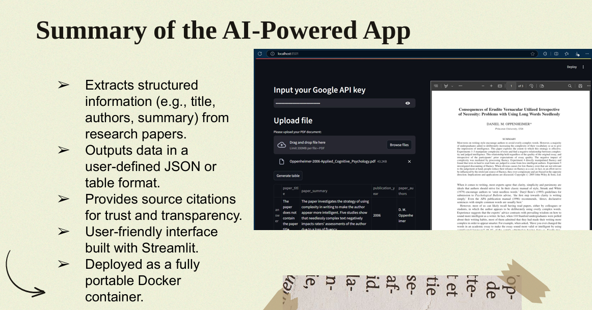

# PDF_EXTRACTOR MINI PROJECT

## Project Description
**PDF_EXTRACTOR** is a project designed to extract and process data from PDF files using the **Retrieval-Augmented Generation (RAG)** approach. This project leverages tools like **LangChain**, **ChromaDB**, and **Streamlit** to build a robust pipeline for querying and retrieving information from PDFs.
## Project Resources

- [Download PDF](Mini-Project_ Extracting Structured Data from PDF.pdf)

## Application Screenshot


This work is inspired by [Thu Vu's YouTube tutorial](https://www.youtube.com/watch?v=EFUE4DHiAPM&ab_channel=ThuVu) and her repository [structured-rag-pdf](https://github.com/thu-vu92/structured-rag-pdf).

## What I Learned
Through this project, I gained knowledge and experience in:
- Setting up a vectorstore using **LangChain** to process and store data from PDFs.
- Using **ChromaDB** to manage vectorized data for efficient retrieval.
- Building an interactive user interface with **Streamlit**.
- Implementing RAG techniques to combine retrieval with large language models (LLMs) for enhanced query responses.

## Project Structure
```
PDF_EXTRACTOR/
├── .venv/                       # Python virtual environment (ignored in .gitignore)
├── app/
│   ├── __pycache__/             # Python cache files (ignored in .gitignore)
│   ├── vectorstore_*            # Vectorstore files for specific datasets
│   ├── functions.py             # Core functions for PDF processing and RAG logic
│   ├── myapp.py                 # Main application file for Streamlit
│   ├── requirements.txt         # Dependencies required for the app
│   ├── streamlit_app.py         # Streamlit app configuration
├── data/                        # Folder containing input PDF files
├── vectorstore_chroma/          # ChromaDB storage for vectors
├── vectorstore_test/            # Test vectorstore folder
├── .env                         # Environment variables (e.g., API keys) (ignored in .gitignore)
├── data_extraction_final.ipynb  # Jupyter Notebook for experimentation
└── requirements.txt             # Additional dependencies list
```

## Installation Guide
To set up and run this project locally, follow these steps:

1. Clone the repository:
   ```
   git clone https://github.com//PDF_EXTRACTOR.git
   cd PDF_EXTRACTOR
   ```

2. Create a virtual environment and install dependencies:
   ```
   python -m venv .venv
   source .venv/bin/activate  # For Linux/MacOS
   .venv\Scripts\activate     # For Windows
   pip install -r requirements.txt
   ```

3. Run the Streamlit application:
   ```
   streamlit run app/myapp.py
   ```

## Features
- Extracts text and information from PDF files.
- Stores processed data as vectors for efficient retrieval.
- Provides a user-friendly interface via **Streamlit**.
- Implements Retrieval-Augmented Generation (RAG) to enhance query results.

## Example Usage
1. Place your PDF files in the `data/` directory.
2. Run the application using Streamlit.
3. Query information from the uploaded PDFs through the user interface.

## `.gitignore` File Content
To ensure sensitive files and unnecessary artifacts are not pushed to GitHub, the following `.gitignore` file is used:
```
# Ignore Python virtual environment folder
.venv/

# Ignore sensitive environment variables file
.env

# Ignore Python cache files and folders
__pycache__/

# Ignore temporary or log files
*.log
*.tmp

# Ignore system-specific files (e.g., macOS)
*.DS_Store

# Ignore vectorstore folders (optional, if you don't want to push them)
vectorstore_chroma/
vectorstore_test/
```

## Acknowledgments
This project was built with guidance from:
- [Thu Vu's YouTube tutorial](https://www.youtube.com/watch?v=EFUE4DHiAPM&ab_channel=ThuVu).
- [Thu Vu's GitHub repository](https://github.com/thu-vu92/structured-rag-pdf).

## License
This project is licensed under the MIT License. Feel free to use, modify, and distribute it as needed.

---
